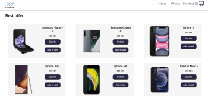

# CellNow-shopping app

A shopping app for a online cellphone store. The project was build as an assignment by a company using React.js with react hooks and TypeScript. The styling was done with [Emotion](https://emotion.sh/docs/introduction).

| | |  | | |

## Functionalities

- **items can be added to a cart**
- **the quantity of items in the cart can be increased or decreased**
- **items can be removed from cart**
- **the whole cart can be cleared at once**

## How to use it

- **Clone the repo: git@github.com:Danijela2019/cell-now-shopping.git**
- **Position yourself (cd) in the cell-now folder**
- **Run this command in the terminal to install packages: 'npm install'**
- **Next run this command in your terminal 'npm start'**
- **View the application in the browser(http://localhost:3000)**
